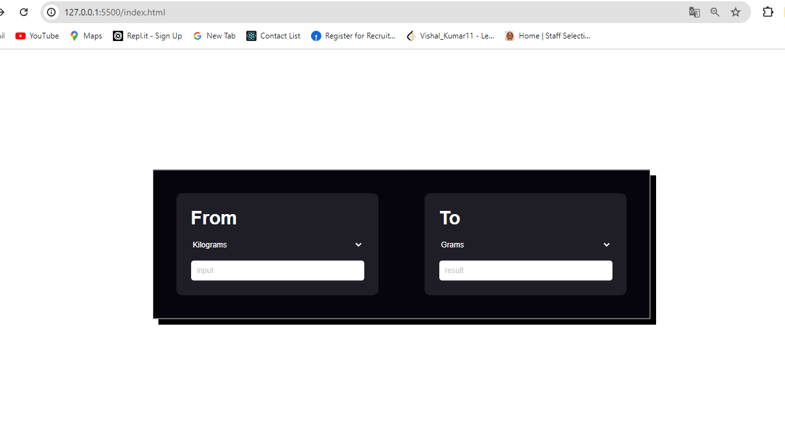
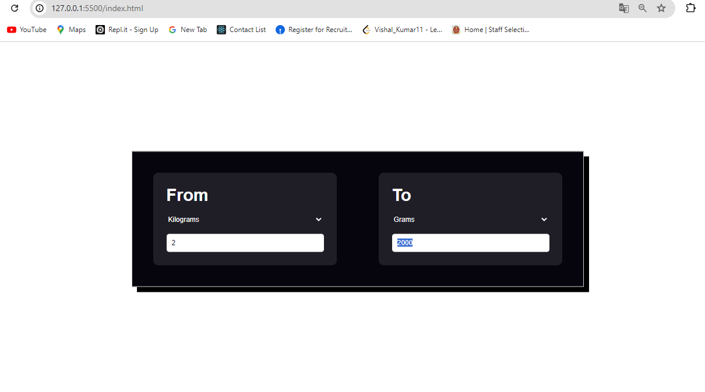
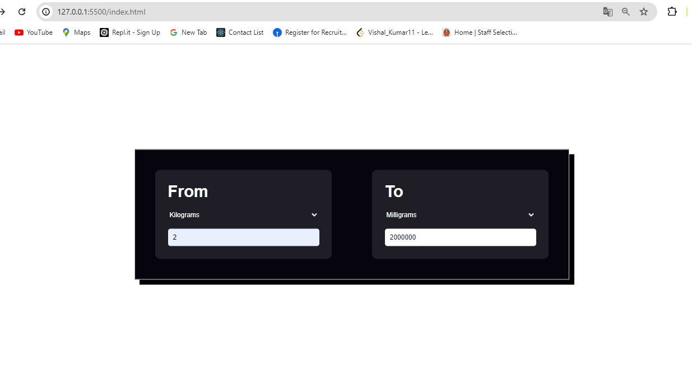
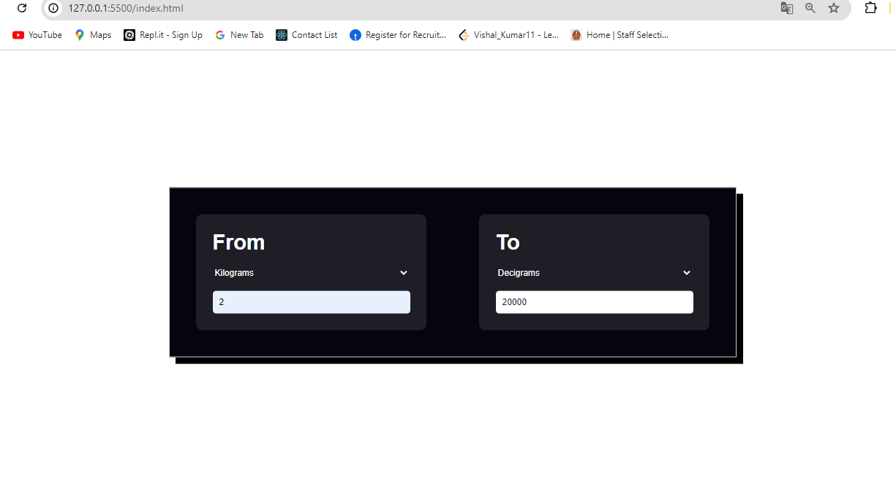
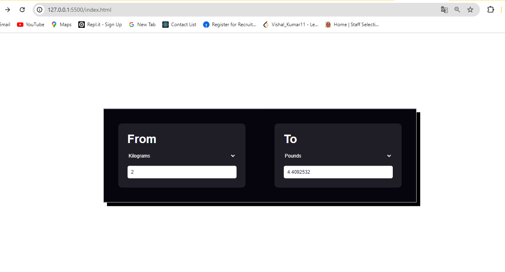

# Unit Conversion Tool

The **Unit Conversion Tool** is a web-based application designed to convert between various units of mass, such as kilograms, grams, milligrams, pounds, and decigrams.

## Getting Started

### Prerequisites

- A web browser (e.g., Google Chrome, Firefox, Safari)

### Running the Tool

1. Save the `index.html`, `style.css`, and `script.js` files to your local machine.
2. Open the `index.html` file in your web browser.

## Usage

1. Select the unit you want to convert from in the "From" dropdown menu.
2. Enter the value you want to convert in the input field.
3. Select the unit you want to convert to in the "To" dropdown menu.
4. The converted value will automatically appear in the result field as you type.

## Code Overview

### HTML Structure

- The HTML file includes a form with dropdown menus for selecting the units and input fields for entering the values.
- The `div` elements within the `.container` class are used to structure the input and result sections.

### JavaScript Logic

- The `script.js` file contains the logic for performing the unit conversions.
- Event listeners are added to the input fields and dropdown menus to trigger the conversion calculation whenever the user inputs data or changes the selected units.

### CSS Styling

- The `style.css` file contains the styles for the layout and design of the tool, ensuring a user-friendly interface.

## Notes

- Ensure the `style.css` and `script.js` files are located in the same directory as the `index.html` file for proper functionality and styling.
- The tool does not require an internet connection to operate once the files are saved locally.

Enjoy using the Unit Conversion Tool!

### Out Put Screen

#### Initial Home Page

#### Conversion KiloGram to Gram

#### Conversion KiloGram to MiliGram

#### Conversion KiloGram to DeciGram

#### Conversion KiloGram to Pound
